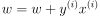

##Lecture2 The Perceptron learning procedure

####神经网络的结构

- Feed-forward neural network （最常见）
  - 对于输入的变形，得到新的表示形式，让不相似的变得相似，或相似的变得不相似（如语音识别中，让不同人说的同一个音节相似，同一个人说的不同音节不相似）

- recurrent neural network
  - 信息在一个圈里流动(remember information for long time)
  - 能展示各种有趣的震荡，但是它们很难训练，一部分因为他们能实现的东西会更加复杂。在连接图中是有向的边，意味着有可能回到你的起点，从生物学来说，更加现实，因为他们复杂的动态性，很难训练。有多隐层的RNN是有隐层到隐层的连接丢失的一种特殊情况。
  - RNN是非常自然地对序列的数据建模：等同于每个时间片有一个隐层的深度网络，除了在每个时间片使用相同的权重，而且每个时间片都得到输入。隐层状态可以长时间记忆信息。
  - 一个RNN的例子：预测一个序列中的下一个字母。一次一个字母生成英文文本(马尔科夫模型也有[例子](https://github.com/xxg1413/MachineLearning/blob/master/Web%20Scraping%20with%20Python/Chapter8/markov-generator.py))
  
- symmetrically connected network
	- 两个单元的weights在两个方向都是相同的。和RNN类似，但是神经元之间的连接是对称的。Hopfield认为对称网络比递归网络更加容易分析，但同时他们能做的东西也更受限，因为他们遵循能量函数（比如，不能对循环圈建模）。没有隐层的对称连接网络叫做Hopfield nets。

####感知机Perceptrons：第一代神经网络
- 1960年开始流行，后被证明能力有限
- 遍历数据集：分类正确的数据不改变权重；目标为-1，分类为1的数据，权重减数据；目标为1，分类为-1，权重加数据，即 

- 关于感知机，参考《统计学习方法》

####感知机的几何解释
- Weight-space：空间中的点表示一个特定的权重向量；假设我们消除了偏移量，每一个训练样本在权重空间中可被通过原点的超平面表示（这个平面与输入向量垂直）。对于一个训练样本，权重向量必须在这儿超平面的一侧才能预测正确。

- 为了所有训练数据分类正确，我们要找到一个在所有平面的正确一侧的点（可能没有），如果存在任何权重向量对于所有训练数据都分类正确，那么它以原点为顶点在一个圆锥区域，所以两个好的权重向量的平均值也是好的，这个问题是凸的convex。

####为什么学习有用

####感知机不能做什么

- 取决于输入的特征。如异或运算，输入+1，-1；简单的图形如果允许wrap-around移动（有相同个数像素点），也无法区分（？）Group Invariance Theorem：如果变换形成一个group，则the part of a Perceptron无法学习到分类。

- data-space：每个输入向量是数据空间的一个点，权重向量确定数据空间上的一个平面（平面与权重向量垂直）

- 没有隐层单元的神经网络是受限的。我们需要多层可自动调节、非线性的隐层单元，学习到隐层单元的权重等价于学习特征，这个很困难，因为没有人直接告诉我们隐层单元应该做什么。